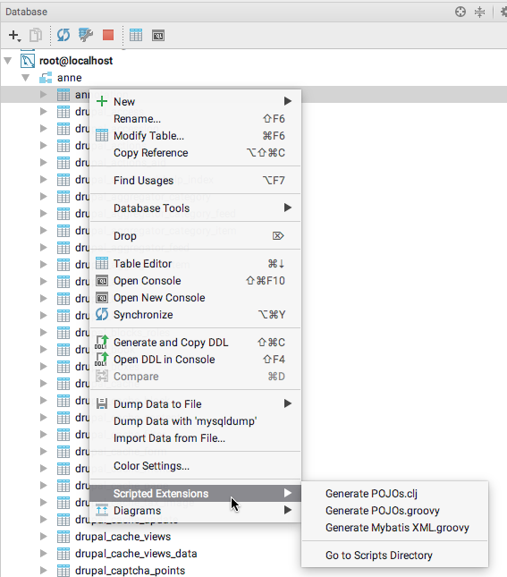
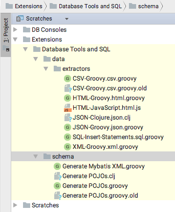

About MyBatis Scripted Extension
================================

This is a IntelliJ IDEA *Scripted Extension* that exports a single
table into Mybatis XML Mapper file.

Installation
------------

On MacOS, copy the `groovy` file into 

	$HOME/Library/Preferences/IntelliJIdea2017.1/extensions/com.intellij.database/schema

(Adjust the path according to your IntelliJ version.)

Alternatively, from the **Scratches** view, put the file into `Extensions / Database Tools and SQL / Schema` folder.

Running
-------

In the **Database** view, pick an arbitrary table. Right click and use **Scripted Extensions** / **Generate Mybatis XML**.

Settings
--------

*	**Entity Package**: the Java package that will hold the mapper XML. This will be used in the `<resultMap>` element in the `resultType` attribute.
*	**Entity Class Name**: the name of the Java object that will be mapped. It is used to:
	*	deduce the `resultType` in the `<resultMap>` declaration
	*	deduce the name of the XML file.
	If omitted, the class name will be deduced from the table name.
*	**Mapper Namespace**: the Java package of the mapper XML file. It should **not** contain the class name! (Mybatis uses the full mapper class name as a mapper namespace. The class name will be deduced from the *Entity Class Name* and the *Mapper Namespace*).

Scripted Extensions
===================

*IntelliJ IDEA Database Tools and Extensions* provide a nice plugin-like mechanism
for data and metadata export. A few lines of Groovy / Clojure code and
tables and their data can be transformed into any reasonable format.

Actually, the CSV, JSON and SQL Insert format are implemented via
this mechanism, which is officially called **Scripted Extensions**.

As an example, let's implement MyBatis Scripted Extensions that
will dump the table structure into MyBatis mapper definition in XML.

The *Scripted Extension* can be reached by right-clicking
on any table in the **Database** view. Any available extension
will be show in the submenu.

The source codes of *Scripted Extensions* are available in a slightly strange place: in the **Scratches** section. It's available via dropdown menu in the top-right corned of idea (by default, this dropdown is set to the **Project** item).

There are two categories:

*	*extractors* are used to export table data to various formats
*	*schema* to transform table metadata into multiple representations.

As of IntelliJ IDEA 2017.1, there are three available schema exportes. These are examples implemented in Groovy, Groovy again (.old :-)) and Clojure.

Implementing Scripted Extension
===============================

The actual implementation process might be much more simple than
full-fledged IntelliJ IDEA, but there are some steep points in the learning curve.

The Groovy extension is .. well.. a simple one-file Groovy script. However,
IDEA won't give you much debugging or very reasonable code-completion.

However, this might be useful starting points. The most fundamental one is the
`/Applications/IntelliJ IDEA.app/Contents/lib/src/src_database-openapi.zip`. This
ZIP contains source code for the OpenAPI extension. Might be worth the look.

Since there is no published JavaDoc API for the *Scripted Extensions*,
studying the source is the primary source of information.

Creating a Scripted Extension
=============================

Creating a *Scripted Extension* is easy. Just decide, whether it's **extractor** of table data or whether it's *schema exporter*. In the **Scratches** view, right click the proper directory (`extractors` or `schema`) and create a new Groovy file.

There is no need for `main()` method or anything. It's a *Groovy* script, after all.

Groovy Bindings
===============

The *Scripted Extension* exposes multiple predefined global variables:

*	`PROJECT` (`com.intellij.openapi.project.Project`) represents a project that is currently open
*	`SELECTION` (`Iterable<com.intellij.database.model.DasObject>`) holds a collection of objects selected by user
*	`FILES` (`com.intellij.database.view.generators.Files`) is a simple helper object to show 'Save' dialog
*	`LOG` (`com.intellij.database.view.generators.Logger`) is a simple logger object.

All objects are defined in the `com.intellij.database.view.generators.SchemaScriptBindings` file in the
Database OpenAPI.

Important objects
=================

Das entities
------------

The whole database tree is represented by `com.intellij.database.model.Das____` objects (is it a Kraftwerk `Das Model` reference?).
Furthermore, all objects that are selected by users are available in the global `SELECTION` variable,
being a collection of `DasObject`. 

### DasTable

Most often, the `DasTable`, a subclass of `DasObject`, is most relevant, since it corresponds to a table.

### DasUtil

Another useful class `com.intellij.database.util.DasUtil` holds a multiple utility static methods. 

*	`getColumns()` retrieves a list of columns from a single `DasTable`.
*	`getPrimaryKey()` is a shortcut that retrieves a primary key constraint of the table.

## FILES (`com.intellij.database.view.generators.Files`)

This simple helper holds a few methods that arrange 'Save' dialogs:

*	`chooseFileAndSave()` opens a simple 'Save File' dialog that can be used to save the resulting export data
*	`chooseDirectoryAndSave()` opens a simple 'Save to Directory' dialog to save a set of result files

## LOG (`com.intellij.database.view.generators.Logger`)

The `LOG` is a dumbed-down version of Logger API. There are only a few methods:

*	`print(String)` which logs a simple string
*	`error(String)` which logs a simple error message string
*	`error(String, Throwable)` to log both message and exception.

By default, `LOG` logs into `IntelliJ IDEA Log` (it does *not* log to the `Run` output, nor to the 
IDEA **Event Log**). 

The log can be show via **Help | Show Log in Finder** and then via **Console** application on MacOS.

Tips and tricks
===============

Handling output
---------------

Many *Scripted Extensions* just pass arount a `Writer` object that is used to append
the generated lines. As an alternative, despite being more memory heavy, is to pass around String objects.

In Groovy, it's even better, since we can pass around much more improved Groovy strings, `GString`s.

Opening custom dialogs
----------------------

The *Scripted Extensions* are not quite ready for the customization of the export
procedure. However, we can open a custom dialog:

*	a `com.intellij.openapi.ui.DialogWrapper` subclass can be created in the script.
*	the dialog can be spawned in the proper thread via `com.intellij.openapi.application.ApplicationManager` 
	and its `invokeLater()` method that takes `Runnable` with the dialog-opening code.

Organizing scripts
------------------

The one-file convention calls for a bit of organization. 

*	we *can* create a custom classes. The methods will be called from Groovy script from the "main" code
*	`import` statements are not required to be in the beginning of file
